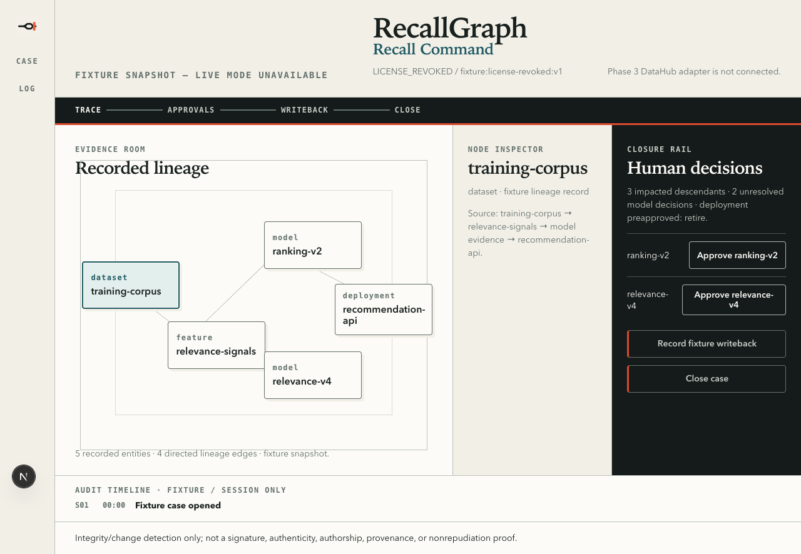
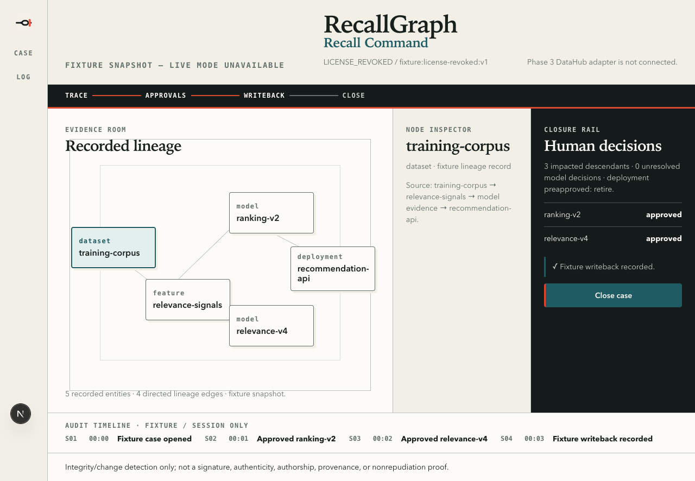
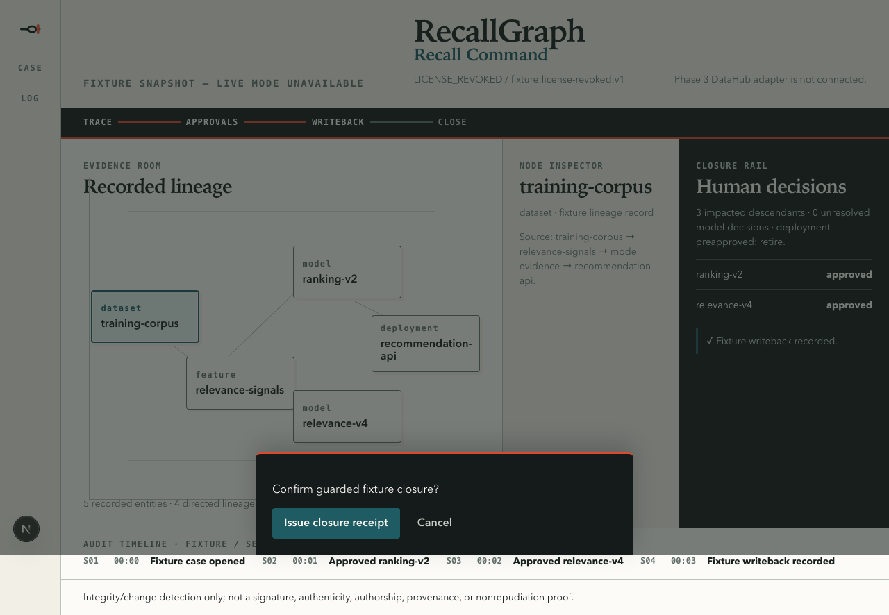
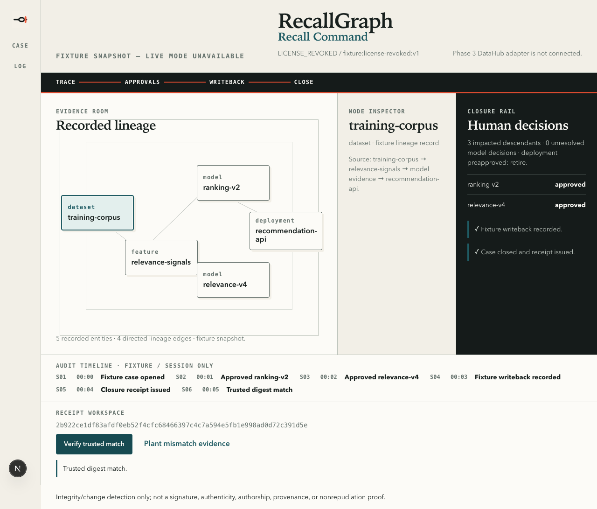

# RecallGraph: deterministic model recall closure evidence

RecallGraph traces compromised training data into affected models and deployments. It gives model-risk and data-governance teams a deterministic closure workflow with human approvals, writeback evidence, and a verifiable integrity receipt.

[](https://www.typescriptlang.org/)
[](https://nextjs.org/)
[](#testing)
[](LICENSE)



## Live Demo

**[https://recallgraph.vercel.app](https://recallgraph.vercel.app)**

The hosted console uses recorded fixture evidence. It never presents fixture data as a live DataHub result.

## Demo Video

**[Watch the 2:03 RecallGraph demo](https://github.com/ajanaku1/RecallGraph/releases/download/v1.0.0-demo/recallgraph-demo.mp4)**

The film uses Microsoft Edge TTS narration, burned-in captions, real product screenshots, and retained DataHub OSS evidence. It stays below the hackathon's three-minute limit.

## Feedback Survey

Use the [RecallGraph product feedback form](https://github.com/ajanaku1/RecallGraph/issues/new?template=feedback.yml). Do not include confidential incident data, credentials, or personal information.

## What Is RecallGraph?

A compromised training dataset can affect several models and production deployments. The hard part is proving that every affected asset has a reviewed disposition before the incident closes.

RecallGraph turns that process into a typed recall case. Deterministic graph rules identify affected descendants, block unsafe closure, record human decisions, and issue a canonical SHA-256 receipt after writeback succeeds.

## Screenshots

| Initial blocked recall | Writeback complete |
| --- | --- |
|  |  |

| Guarded closure | Verified receipt |
| --- | --- |
|  |  |

## Features

- **Deterministic impact analysis**: Traverses normalized lineage with stable cycle, diamond, and duplicate-path handling.
- **Typed recall triggers**: Supports license revocation, erasure requests, and critical corrections in the domain model.
- **Human approval gates**: Requires explicit dispositions for consequential model decisions.
- **Fail-closed closure**: Blocks on unresolved decisions, uncertainty, invalid ownership, stale approvals, or missing writeback evidence.
- **Canonical integrity receipts**: Exports the complete evidence payload and a stable SHA-256 digest.
- **Separated trust check**: Recomputes the submitted receipt and compares it with a server-retained trusted digest.
- **DataHub live gate**: Proves one real MCP lineage read and one reversible metadata mutation against DataHub OSS.
- **Accessible recall console**: Provides keyboard inspection, native dialog semantics, visible focus, recovery boundaries, and a mobile lineage stepper.

## Evidence Modes

RecallGraph keeps live proof and demonstration data separate.

| Mode | Source | Persistence | Claim |
| --- | --- | --- | --- |
| Live gate | DataHub OSS plus DataHub MCP | DataHub metadata | Real lineage read and reversible metadata writeback |
| Hosted fixture | Recorded normalized graph | Browser session | Deterministic product walkthrough, not live sponsor evidence |

The console header states when live mode is unavailable. Receipt payloads also record the evidence identity and mode.

## Tech Stack

| Layer | Technology |
| --- | --- |
| Application | Next.js 16 App Router, React 19, TypeScript 6 |
| Domain core | Pure TypeScript graph, recall, validation, canonical JSON, SHA-256 |
| Live catalog proof | DataHub OSS, `mcp-server-datahub` 0.6.0, DataHub Python SDK |
| UI testing | Vitest, Testing Library, jsdom |
| Core testing | Node test runner |
| Live-gate testing | Python `unittest` |
| Quality gates | ESLint 10, typescript-eslint, TypeScript AST function checker |
| Deployment target | Vercel |

## Testing the App

The default walkthrough is deterministic and resets on reload.

1. Open the console.
2. Inspect the dataset, feature, two model nodes, and one deployment node.
3. Confirm that closure and writeback are blocked.
4. Approve `ranking-v2`.
5. Approve `relevance-v4`.
6. Record the fixture writeback.
7. Open the guarded closure dialog.
8. Issue the closure receipt.
9. Verify the trusted match.
10. Plant mismatch evidence and confirm that verification detects it.

Expected fixture result:

```text
impact: 2 models, 1 deployment (3 descendants); unresolved initially: 2
closure: blocked -> closable after 2 human approvals and 1 successful writeback
receipt: trusted match=true mismatch=true
```

## How It Works

```text
Recall event
    |
    v
Normalized lineage graph
    |
    +--> deterministic affected-descendant traversal
    +--> uncertainty and owner checks
    +--> human disposition requirements
    |
    v
Closure evaluation
    |
    +--> blocked: return exact blockers
    |
    +--> closable: require successful writeback
                      |
                      v
                canonical receipt payload
                      |
                      v
                SHA-256 integrity digest
```

The browser never imports the Node-only hashing core. App Router server code owns approval commands, closure evaluation, receipt creation, and receipt verification.

## Architecture

RecallGraph has four layers:

1. `src/core`: pure domain types, graph traversal, recall rules, validation, canonical JSON, and receipt logic.
2. `src/catalog`: typed fixture factories that match the normalized graph contract.
3. `scripts`: DataHub seed, live readback, reversible mutation, fixture verification, and quality gates.
4. `src/app`: the server route and accessible browser console.

The current hosted application is the fixture fallback. The DataHub integration is proved through the local live gate and its retained evidence file.

## API Reference

All fixture commands use `POST /api/recall` with JSON.

| Command | Required fields | Success result |
| --- | --- | --- |
| `approve` | `assetId` | Exact `{ approved }` record |
| `writeback` | `approvedAssetIds`, `retry` | Server-issued `{ writeback }` record |
| `close` | `approvedAssetIds`, `writebackRef` | Complete `{ receipt: { payload, digest } }` envelope |
| `verify` | `receipt` | `{ match, disclaimer }` integrity result |

Malformed, mixed, non-JSON, timeout, and non-success responses fail closed in the client. Verification request identities prevent stale completions from replacing newer user intent.

## Running Locally

### Prerequisites

- Node.js 20.9 or newer
- npm
- Python 3.10 or newer for live-gate tests
- FFmpeg for submission-video verification
- DataHub OSS, `uv`, and a Python environment with `acryl-datahub` for the live gate

### Install and start the fixture console

```bash
git clone https://github.com/ajanaku1/RecallGraph.git
cd RecallGraph
npm install
npm run dev
```

Open [http://localhost:3000](http://localhost:3000).

No environment variables are required for fixture mode.

### Run the DataHub live gate

Start DataHub OSS and confirm that GMS responds at `http://127.0.0.1:8080`. Point `DATAHUB_PYTHON` to a Python interpreter that can import `datahub`.

```bash
export DATAHUB_PYTHON=/absolute/path/to/python
export DATAHUB_GMS_URL=http://127.0.0.1:8080

npm run seed:live-gate
npm run test:live-gate
npm run verify:live-gate
```

The verification step reads lineage through `mcp-server-datahub==0.6.0`. It writes a probe property, confirms readback, restores the original value, and records evidence in `.evidence/live-gate.json`.

## Available Scripts

| Command | Purpose |
| --- | --- |
| `npm run dev` | Start the Next.js development server |
| `npm run build` | Create the production build |
| `npm run start` | Serve the production build |
| `npm run lint` | Run ESLint across source, tests, and scripts |
| `npm run typecheck` | Run strict TypeScript validation |
| `npm test` | Run core, fixture, UI, submission, and rollback tests |
| `npm run test:privacy` | Enforce the public/private repository boundary |
| `npm run verify:fixture` | Prove the planted fixture journey and receipt mismatch |
| `npm run seed:live-gate` | Seed the minimal DataHub lineage graph |
| `npm run test:live-gate` | Check the seeded DataHub graph without mutation |
| `npm run verify:live-gate` | Run MCP lineage plus reversible metadata proof |
| `npm run verify:submission` | Verify public release evidence and demo duration |

## Testing

Run the full local suite:

```bash
npm test
npm run build
./verify.sh phase-5
```

The suite covers graph cycles and duplicates, closure blockers, semantic boundary validation, canonical receipt stability, malformed transport responses, timeouts, stale verification races, accessible recovery states, and reversible rollback failure paths.

## Project Structure

```text
.
├── .evidence/             # Retained live DataHub proof
├── brand/                 # Approved mark, palette, and interface contract
├── docs/images/           # Real application screenshots
├── public/                # Selected logo and favicon
├── scripts/               # DataHub, fixture, submission, and quality gates
├── src/
│   ├── app/               # App Router console and fixture command route
│   ├── catalog/           # Typed fixture cases
│   └── core/              # Pure deterministic recall engine
├── submission/            # Judge-facing copy and evidence manifest
├── tests/                 # Core, UI, live-gate, and contract tests
├── LICENSE                # Apache License 2.0
└── verify.sh              # Phase verification entry point
```

## Deployment

The Next.js application has no hosted-mode secrets or external database. Deploy it to Vercel with:

```bash
vercel --prod
```

The deployment remains fixture-only unless a server-side DataHub adapter is configured. Do not relabel the hosted fixture as live DataHub evidence.

## Limitations

- The hosted console uses fixture evidence and browser-session state.
- The Phase 0 live proof is local DataHub evidence. The hosted UI does not connect to DataHub.
- The fixture route does not provide production authentication, authorization, or durable case storage.
- RecallGraph records decisions and metadata. It does not stop deployments, retrain models, or execute unlearning.
- Lineage analysis cannot detect undeclared data overlap outside the catalog graph.
- The SHA-256 receipt detects changes. It is not a signature and does not prove authorship, authenticity, provenance, or nonrepudiation.
- A failed or unreachable rollback is reported as `RollbackFailure`; external DataHub recovery may still require operator action.

## License

RecallGraph is licensed under the [Apache License 2.0](LICENSE).
